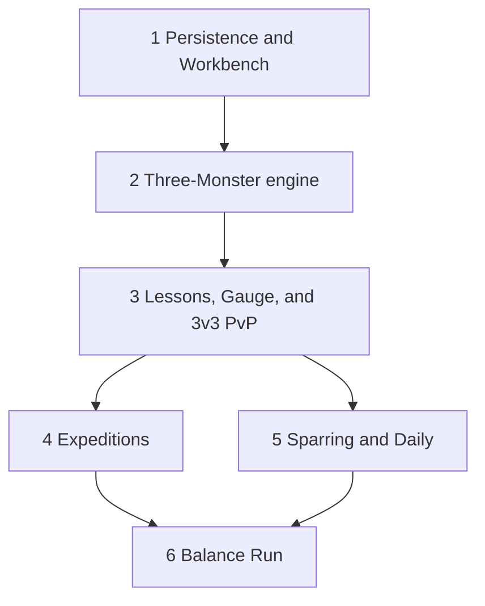

# Implementation rollout - decided (TERM-49)

This rollout replaced the 1v1 server with the destination Collection, three-Monster, progression, Expedition, and Dojo Master contracts. Local Saves and the 1v1 engine were not compatibility targets. The requirements below preserve the implementation sequence and acceptance gates that produced one Save shape and one Battle engine.

Each slice was considered done when a Trainer could exercise it on `go run ./cmd/termond`. The destination Save and engine were the only shapes later slices could load.

## Rules

These constraints keep the destination contracts intact. They do not preserve 1v1 play.

1. **Replace the [Save payload](progression-persistence.md) in slice 1.** Onboarding, Load, Reset, and Battle copies use Collection IDs and `Party [3]string`. Save version stays 1. Do not extend the inline `Party []Monster` shape.
2. **One Battle engine.** Replace `internal/battle` rather than wrapping it. Solo modes may field one to three Monsters. Queue and Challenge always field three.
3. **Close PvP until it is the destination format.** Do not ship lead-only Queue, un-normalized Queue, or 1v1 Challenge as a stepping-stone format.
4. **Normalize Queue in the same slice that reopens it.** That slice also pays the first XP. Persistent Level must not affect PvP stats.
5. **Keep production views in `internal/tui`.** The throwaway prototype commands were removed after their layouts were incorporated.

## Slice sequence

The 1v1 Practice, Queue, and Challenge loops are removed as soon as the packages they live in are replaced. Close those entry points rather than keeping them working.

| Slice | Playable loop | Queue and Challenge | Status |
| --- | --- | --- | --- |
| 1 Persistence and Workbench | Onboard, Dojo, Workbench | Closed | Implemented |
| 2 Three-Monster engine | Same lobby loop; engine covered by tests | Closed | Implemented |
| 3 Lessons, Gauge, and 3v3 PvP | Starter, two Lessons, Normalized 3v3 | Full Party, three actives | Implemented |
| 4 Expeditions | Signal Board capture onto the bench | Unchanged | Implemented |
| 5 Sparring and Daily | Rest of the Dojo Master menu | Unchanged | Implemented |
| 6 Balance Run | Operator harness | Unchanged | Implemented |

## Slice 1: Persistence and Workbench

Put the destination Save on disk and let the Trainer manage the starter. Combat entry points may stop working in this slice.

You must:

- Set schema version 3 and create `activity_results`.
- Implement the Store operations in [Progression persistence](progression-persistence.md), including Workbench mutations and `RecordActivityResult`.
- Write onboarding as Collection plus Party `[starterID, "", ""]`.
- Keep Save version at 1. Replace the payload struct. A payload that does not decode is `ErrCorruptSave`.
- Open the [Collection and Party terminal flow](collection-party.md) with `p` from the Dojo.

You must not reopen Queue or Challenge. Remove or disable Practice if it still reads the old Monster shape.

**Exit:** A new Trainer onboards into the Collection payload and edits Loadout and nickname in the Workbench. Reconnect sees the same Collection.

## Slice 2: Three-Monster engine

Replace the 1v1 engine and Battle TUI with the [Three-Monster Battle contract](party-battles.md) and [three-Monster Battle terminal view](party-battle-view.md).

You must:

- Own complete Party state, Switch, Replacement, `revealing`, viewer-specific snapshots, and `NaturalStat` copies.
- Delete `PracticeHash`, `ChoosePracticeMove`, and the one-Monster `Side` model.
- Keep Queue and Challenge closed.

You must not leave a second 1v1 engine in `internal/battle` or `internal/tui`.

**Exit:** Engine tests cover Move versus Switch, Replacement, and three-faint victory. The live server has no Practice fight and no PvP.

## Slice 3: Lessons, Gauge, and 3v3 PvP

This is the first destination playable loop. A Trainer who finishes it has a Full Party and can enter Normalized PvP.

You must:

- Evaluate Capture Objectives after each resolved turn as specified in [Capture Gauge and tactical objectives](capture-gauge.md). Lessons use the authored IDs in [Dojo Master policy and teams](dojo-policy.md).
- Replace onboarding Practice with the two [Capture Lessons](dojo-master.md). Lesson captures use `fill_party`.
- Bind Master Sable adjacency to the Dojo Master menu. Hide Sparring and Daily until slice 5.
- Reopen Queue and Challenge as Normalized three-Monster Battles. Require a Full Party. Use Queue Level 30, budget 320, and Queue-eligible persistent Battle Loadouts.
- Apply [PvP Reward Packets](xp-progression.md) when `ApplyRewards` is true. Show the Progression Summary after Lessons and PvP.

You must not generate Expedition routes yet.

**Exit:** A new Trainer completes both Lessons, holds a Full Party, and finishes a Normalized 3v3. Partial Parties cannot Queue. Practice is gone.

## Slice 4: Expeditions

Open the repeatable Collection loop. Captures append to Collection and never auto-fill the Party.

You must:

- Launch from the Signal Board using the [Expedition contract](expeditions.md) and [Expedition terminal view](expedition-view.md).
- Use the [Capture Objective catalog](capture-catalog.md) generator and Target Encounter PvE band.
- Commit each encounter through `RecordActivityResult` with `fill_party` false.
- Refuse launch when any selected Party Monster has fewer than four loaded Moves.

**Exit:** A Trainer runs a three-encounter route, captures onto the bench, and sees the new individual in the Workbench. A `hunt_failed` Target pays that encounter's XP and does not add a Monster.

## Slice 5: Sparring and Daily Challenges

Fill the rest of the Dojo Master menu after 3v3 PvP already uses the same engine.

You must:

- Ship Sparring tiers, public-state policies, first-clear keys, and Decision Explanations from [Dojo Master modes and bot behavior](dojo-master.md).
- Snapshot the Server Day for Daily Challenges, loan the authored teams, and map loaned slots to owned Party slots.
- Pay Sparring and Daily first-clear XP once. A later Daily par clear writes `daily_mastery` only.

**Exit:** Sparring Apprentice completes against the Trainer's natural Party. Every Trainer on the same Server Day receives the same Daily puzzle. Replay after first-clear grants no XP.

## Slice 6: Balance Run harness

Promote the throwaway Balance Run into a repeatable operator command. This slice does not change Trainer-facing loops.

You must:

- Run the corpus, Reference Teams, and gates in [Gameplay balance methodology](balance-methodology.md) against the authoritative engine and policies.
- Treat a failed gate as a content or policy change, not as a one-off TUI fix.

**Exit:** A Balance Run reproduces from a recorded seed, content revision, and rules revision. Content edits that affect combat, capture, or Dojo policy require a passing run.

## Cuts that still fail

A rewrite may replace 1v1 code. It must not invent a second destination contract.

| Shortcut | Why it fails |
| --- | --- |
| Extend inline `Party []Monster` with XP | Collection IDs and vacant slots still have to exist |
| Ship Workbench against in-memory Collection | Reconnect and Reset cannot see it |
| Keep a 1v1 engine beside a 3-mon engine | Snapshots, bots, and TUI diverge |
| Reopen Queue before Lessons | PvP requires a Full Party of owned Monsters |
| Capture into Party | Expeditions would need a second capture path |
| Award XP in an un-normalized Queue | Persistent Level becomes a PvP stomp |
