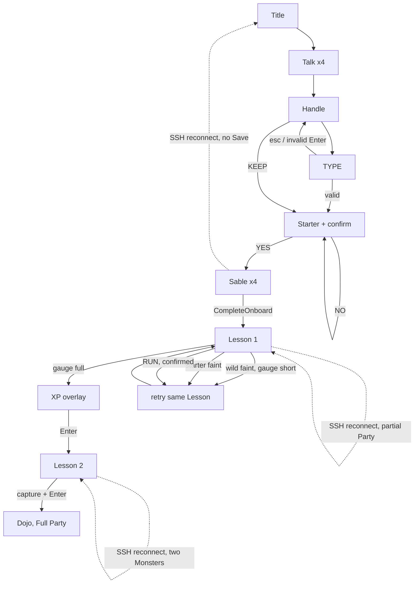

# Onboarding storyboard (current code)

Locked as of 2026-09-01. Read of `internal/tui/onboard.go`, `internal/tui/model.go`, `internal/tui/dojo.go`, `internal/tui/battle.go`, `internal/tui/lobby.go`, `internal/server/hub.go`, `internal/server/hub_lesson.go`.

A new SSH Trainer should understand, in one sitting: who they are, who their partner is, why they need three, how a Capture Lesson is won, and when the Dojo becomes free play. Master Sable narrates the briefing and both Lessons. SWITCH stays hidden until the Party has more than one Monster. Onboarding is compulsory: reconnect with a partial Party resumes the next required Lesson.



`tutorial` is session memory. `onboardedMsg` and a Resume Snapshot with a partial Party both set it. Persist happens only on the last Sable Enter.

## Happy path

### 1. Title — `stageWelcome`

```
╭ termon          First run                    ╮
│                                              │
│                   TERMON                     │
│          the terminal is the arena           │
│               press any key  ▼               │
│                                              │
╰ q quit                                       ╯
```

- Any key except `q` opens talk. Typewriter is not a gate.
- `q` quits the SSH session. `ctrl+c` always quits.

### 2. Talk — four pages, typewriter-gated

Copy, in order:

1. I am Master Sable. This Dojo is my hall.
2. TERMON are creatures you raise and battle over SSH.
3. You are a Trainer. Pick a partner, learn their Moves, fight others.
4. First, who are you?

Master Sable is on stage for talk, the name confirmation, and the Capture Lesson briefing. Enter and space are ignored until `typeOn` finishes. Other keys do nothing.

### 3. Handle — KEEP / REROLL / TYPE

```
╭ termon          Name           SWIFT-OTTER-42 0–0 ╮
│                                                   │
│              What is your name?                   │
│                SWIFT-OTTER-42                     │
│                                                   │
│         ▶ KEEP    REROLL    TYPE                  │
╰ ←→ choose · enter keep · r reroll · e type        ╯
```

- KEEP / Enter on KEEP → "Right! So you are HANDLE!" then starter picker.
- `r` or REROLL rerolls `adjective-noun-NN`.
- TYPE / `e` → `> ` input. Letters, digits, hyphen, max 16. Invalid Enter is silent. Esc back.
- No Save yet.

### 4. Starter + confirm — still no Save

Left to right: Rootkit (Organic), Emberbyte, Aquabit. Sprite + type + flavor. Confirm: "So, you want ROOTKIT?" YES / NO.

- NO, `n`, Esc, backspace → picker.
- YES → "ROOTKIT joined HANDLE!" then Sable. Persist is later.

### 5. Master Sable — four pages, then persist

Copy (Sable stays on stage; he already introduced himself in talk):

1. A Trainer fights with three partners. You have one.
2. Two Capture Lessons fill your Party. Other Trainers wait until then. Press p later for Party and Moves.
3. Fill the Capture Gauge to 100. Use three different Moves. 2× on the TYPE pane is super-effective.
4. A KO with a short Gauge fails — you retry. Let's begin.

Last Enter:

1. `Hub.CompleteOnboard` mints Level 1 starter, Party `[id,"",""]`, seats the Dojo.
2. `onboardedMsg` sets `tutorial=true`.
3. `StartRequiredLesson(1)` places the Trainer beside Sable and starts the 1v1.

Lesson 1 targets: Rootkit→Mistcache, Emberbyte→Sproutware, Aquabit→Wickware.

### 6. Lesson 1 send-out — chrome mid: "Lesson 1"

FIGHT / RUN only. SWITCH is hidden until `YourParty` has more than one Monster.

```
Foe sent out MISTCACHE!  The bar is HP. Three different Moves fill the Gauge.
```

FIGHT prompt: "Pick FIGHT. Use three different Moves. Don't knock it out before the Gauge fills." Footer stays in Sable's voice and lists still-open objectives.

Win condition is a **full Capture Gauge**, not a KO. Gauge full captures even if the wild also fainted. A KO with Gauge < 100 is a named fail, then retry.

### 7. Lesson 1 XP overlay

```
╭ PROGRESSION SUMMARY                         ╮
│ Slot 1 Rootkit   +90 XP  Lv2 (active share) │
│ Slot 2 Mistcache +0 XP   Lv1                │
│ Enter starts Lesson 2 · R review in Workbench│
╰                                             ╯
```

Opens after the win-line hold (`hasPendingProgression`). Enter with `tutorial` and `nextRequiredLesson==2` starts Lesson 2.

### 8. Lesson 2 then free Dojo

Two owned Monsters. SWITCH appears. Objectives: variety, safe switch, matchup. Sable: "Switch when the matchup is bad. Fill the Gauge." Success → XP → Enter → Dojo, `tutorial=false`, Full Party. Queue, Challenge, and Signal Board unlock.

## Negative and skip paths

### F1. NO on confirm

Back to starter picker. No persist.

### F2. CompleteOnboard error

`tutorial` is still false, Save is still nil, screen stays on the last Sable page. Enter retries. `ErrAlreadyOnboarded` copy: "this trainer cannot register right now; try reconnecting."

### F3. StartRequiredLesson error

Save already exists. `ErrorMsg` while `screenOnboard` retries `StartRequiredLesson`. Footer hides Find until the Party is full.

### F4. Wild faint, gauge short of 100 — `hunt_failed`

```
They fainted before the Gauge filled (70/100). Enter retries this Lesson.
Still open: Use 3 different Moves.
```

The wild fainted, so the engine names the Trainer the winner. Then `retryLesson` starts a new send-out. No XP. An earlier Lesson's capture is kept.

### F5. Starter faints

`retryLesson`. Over: "Your partner fainted. We try this Lesson again. Enter retries."

### F6. RUN / `f`

First press arms confirm: "Leave this Lesson? Enter retries it. Esc stays." Confirm forfeits and `retryLesson`. Esc cancels.

### F7. Disconnect mid-Lesson

60s grace. Reconnect with a partial Party sets `tutorial` and auto-starts the next required Lesson.

### F8. Persist error after capture

`retryLesson`. Status: "progress could not be saved".

### F9. Reconnect, Party 1 or 2

Auto-start the next required Lesson. Find / Challenge / Signal Board stay closed until Full Party.

### F10. `R` on Lesson 1 XP

`progressionKey` opens Workbench. `tutorial` stays true. Esc → Dojo with Find hidden. Walking (or reconnect) auto-starts Lesson 2.

### F11. Replay a completed Lesson

Natural key `hash:lesson:N`. No second capture, no XP.

### F12. `n` `n` Reset

First `n` arms: "press n again to erase your save." Second clears Collection, Party, XP, activity results. SSH identity stays. Title again.

### F13. Second SSH session

`DisplacedMsg`. `q` quits.

### F14. Enter mash on Over

`resultHold` ignores Enter. After XP, mash starts Lesson 2 and skips reading the card.

### F15. Disconnect during briefing

No Save yet. Reconnect is the title.

## Scenario catalog

| Id | Trainer action | Code | Feels |
| --- | --- | --- | --- |
| H1 | Any key on title | `stageTalk`. `q` quits. Typewriter not a gate. | ok |
| H2 | Enter through four talk pages | Gated on `typeOn`. | ok |
| H3 | KEEP / REROLL / TYPE | Invalid TYPE Enter silent. | silent reject |
| H4 | Pick starter, YES | Joined + Sable. No Save. | ok |
| H5 | Last Sable Enter | `CompleteOnboard` + Lesson 1. | ok |
| H6 | Fill Lesson 1 gauge | Capture, XP overlay after hold. | ok |
| H7 | Enter on Lesson 1 XP | Auto Lesson 2. Copy: "Enter starts Lesson 2". | ok |
| H8 | Fill Lesson 2 gauge | Dojo, Full Party, tutorial off. SWITCH was shown. | ok |
| F1 | NO on confirm | Back to picker. | ok |
| F2 | CompleteOnboard error | Stay on Sable. Enter retries. | retryable |
| F3 | StartRequiredLesson error | Retry StartRequiredLesson. | retryable |
| F4 | Wild KO, gauge short | Named fail, then retry. | ok |
| F5 | Starter faints | Retry the Lesson. | ok |
| F6 | RUN | Confirm, then retry. | ok |
| F7 | Disconnect mid-Lesson | Reconnect auto-starts the required Lesson. | ok |
| F8 | Persist error after capture | retryLesson. | retryable |
| F9 | Reconnect, Party 1 or 2 | Auto-start next required Lesson. | ok |
| F10 | `f` / `c` with partial Party | "need a full party of three first". Footer hides Find. | ok |
| F11 | `R` on Lesson 1 XP | Workbench; Lesson 2 still required. | ok |
| F12 | Replay completed Lesson | Idempotent. | ok |
| F13 | `n` `n` Reset | Title again. | ok |
| F14 | Second SSH session | Displaced. | ok |
| F15 | Enter mash on Over | After XP, starts Lesson 2. | skips the card |
| F16 | Disconnect during briefing | Title again. | ok |

## Locked decisions

Keep the two authored Lessons in [dojo-master.md](dojo-master.md). Change pacing and naming, not the Save shape.

1. After Lesson 1 XP, Enter starts Lesson 2. Copy: "Enter starts Lesson 2".
2. Short-gauge KO is a named fail card, then retry.
3. Starter faint and RUN retry the Lesson. RUN confirms first.
4. Reconnect with a partial Party auto-starts the next required Lesson. Hide Find until Full Party.
5. Persist failure retries the Lesson.
6. `game.ErrPartialParty` maps to "need a full party of three first".
7. SWITCH is hidden until the Party has more than one Monster.
8. Master Sable narrates briefing and both Lessons.

Reuse `nextRequiredLesson`, `StartRequiredLesson`, `hasPendingProgression`, `pendingBattle`, `TestTutorialCaptureLessonFlow`. Do not add a second onboarding engine.

## Verification after a change

1. `go test ./internal/tui -run 'TestTutorialCaptureLessonFlow|TestTrainerPath|TestOnboard' -count=1`
2. Fresh fingerprint over SSH: title → Lesson 1 (no SWITCH) → capture → XP "starts Lesson 2" → Lesson 2 SWITCH → Dojo, Full Party, `p` shows three.
3. Deliberate wild KO in Lesson 1: fail copy + retry, Party still one.
4. Starter faint and RUN confirm + retry, never dump to a free Dojo.
5. Reconnect with 1–2 Party slots resumes the Lesson, not the floor.
6. `n` `n` Reset returns to the title.
