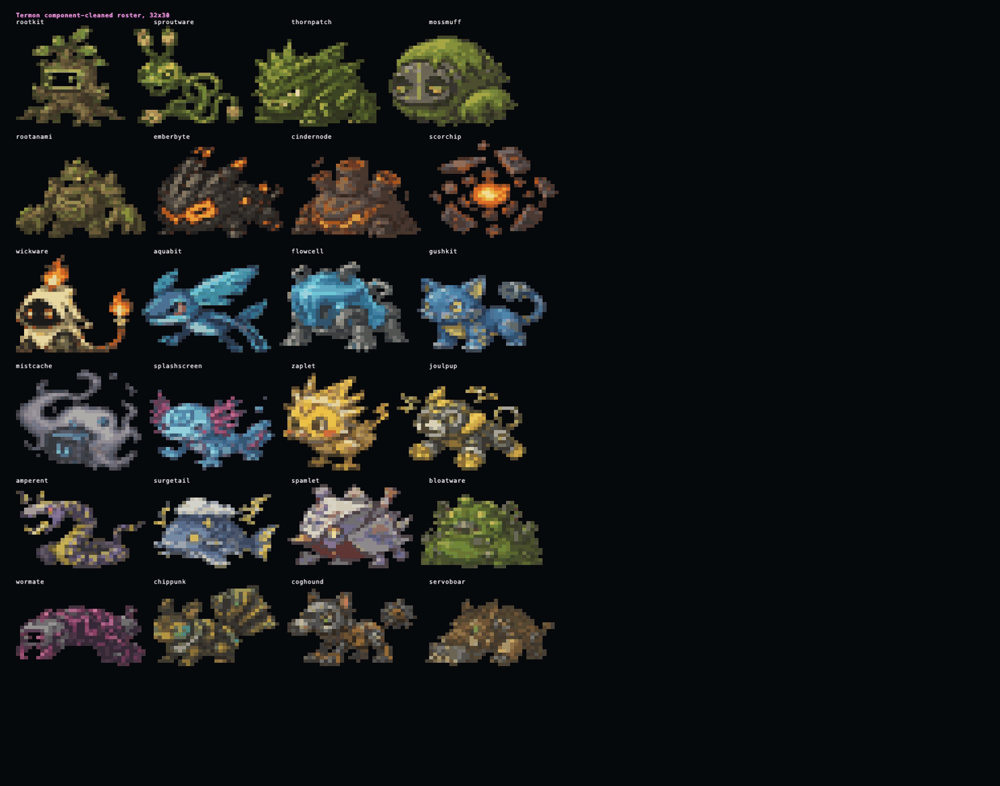
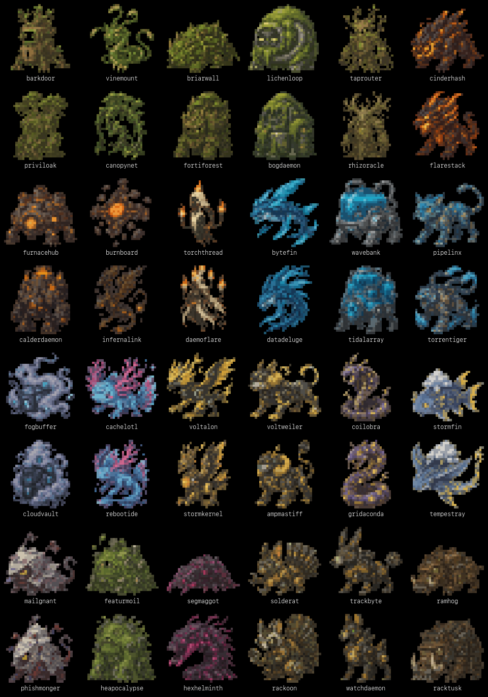

# Generate the monster roster

The accepted roster uses 72 original monster designs rendered from 32×30 PNGs into 32×15 terminal cells. The original sheet contains the 24 base forms and four evolution sheets contain the 48 middle and final forms.





## Asset contract

| Asset | Contract |
|---|---|
| Source sheets | `monster-roster-source.png` plus four files under `evolution-sheets/` |
| Sheet layout | Base sheet: 6 columns by 4 rows. Evolution sheets: 6 columns by 2 rows |
| Species order | `internal/sprite.RosterOrder`, grouped as base, middle, final within each family |
| Review PNG | One transparent `<slug>.png` per species |
| Sprite size | 32×30 pixels, rendered as 32×15 terminal cells |
| Palette | At most 24 colors after conversion, with no dithering |
| Transparency | Pixels below 30% alpha become transparent |
| Game format | `content/art/<slug>.json`, generated from the reviewed PNG |

Every monster must remain an original termon design. Don't add Pokémon names, artwork, silhouettes, or identifying details.

The JSON pixel grid is the runtime source of truth because every SSH client can render true-color half blocks (`▀` and `▄`). Kitty, Sixel, and iTerm2 image protocols aren't portable enough to define game art. Image-first authoring is still useful, but every accepted image must survive conversion to the 32×15-cell fallback.

## Regenerate the PNG roster

Before you begin, install Go and ImageMagick 7. Keep every source sheet on a transparent or black background, preserve its documented row-major order, and place detached effects near their owning monster.

1. Update the relevant base or evolution source sheet.
2. Extract, resize, quantize, and normalize the base sprites:

   ```bash
   ./scripts/convert-contact-sheet.sh
   ```

3. Extract all four evolution sheets:

   ```bash
   ./scripts/convert-evolution-sheets.sh
   ```

   The extractor finds the six largest connected components in each row as monster anchors. It assigns nearby detached effects to the closest anchor, removes unrelated components, and writes the accepted 32×30 PNGs to `docs/design/monster-sprites/`. The evolution script supplies an explicit row-major name list for each sheet, so the filenames remain tied to the canonical Species slugs.

4. Confirm that the converter produced 72 sprites:

   ```bash
   find docs/design/monster-sprites -maxdepth 1 -name '*.png' ! -name 'full-*' | wc -l
   ```

   The result must be `72`.

## Review the terminal result

Review the PNGs before importing them into game content.

1. Generate a static ANSI contact sheet and open it with color preserved:

   ```bash
   go run ./cmd/artsheet --png-dir docs/design/monster-sprites > docs/design/monster-sprites/full-roster.ans
   less -R docs/design/monster-sprites/full-roster.ans
   ```

Check silhouettes, detached effects, transparent edges, palette banding, and clipping. Each silhouette needs a distinct body shape and an identifying edge feature, such as ears, thorns, flame, fins, a tail, or tusks. Use the darkest body hue selectively around the rim, reserve near-black colors for details such as eyes, and keep lighting consistent across the roster. Fix the source sheet and repeat the conversion when a sprite fails review.

## Import the accepted roster

After all 72 PNGs pass review, replace the game art grids with the accepted designs:

```bash
go run ./cmd/artimport
```

The importer converts each opaque color to a stable palette rune and writes a 32×30 grid to `content/art/<slug>.json`. The game and static sheet then use these files by default.

## Verify the imported roster

Run the content checks and regenerate the static terminal sheet from imported art:

```bash
go test ./...
go run ./cmd/artsheet > docs/design/monster-sprites/full-roster.ans
```
